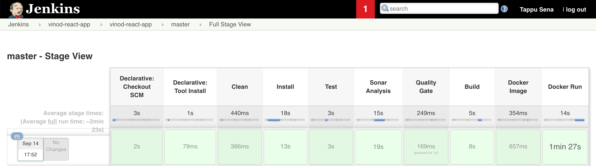
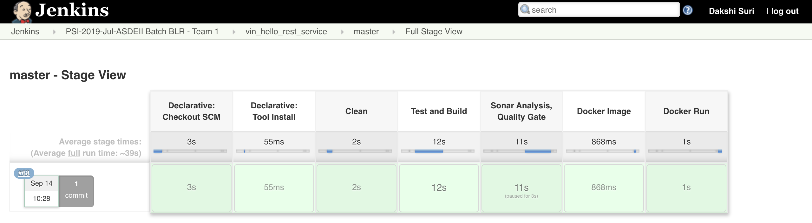

# Bitbucket + Jenkins Declarative Pipeline + AWS + Docker


Two projects are here:

1. Frontend React Hello App: vinod-react-app
1. Backend Spring boot REST service: vin-hello-rest-service





## `Dockerfile` for the frontend/React app

```sh
FROM python
WORKDIR /app
COPY build/. /app/
CMD ["python", "-m", "http.server", "4000"]
EXPOSE 4000
```

### Remember these points:

1. The value 4000 represents the port number being used by the HTTP server within the docker container
2. And this value should be exposed
3. The same value is exposed via port 80 in the `docker run` command in the `Jenkinsfile` as shown below:

```sh
stage ('Docker Run') {
    steps {
        sh "docker build ./ -t ${FINAL_NAME} && docker run -d -p 80:4000 --name ${FINAL_NAME}-container ${FINAL_NAME}"
    }
}
```

So, best is to keep the file unchanged!


## `Jenkinsfile` for the frontend application

```sh
pipeline {
    agent any

    tools {
        nodejs "node10"
    }

    environment {
        CI = 'true' 
        FINAL_NAME = 'vinod-react-app'
    }
    
    stages {
    	stage ('Clean') {
		    steps {
            	sh "rm -rf build"
            }
		}        
        stage('Install') { 
            steps {
                sh "npm i"
            }
        }
        stage ('Test') {
		    steps {
                sh "npm test"
            }
		}
        stage('Sonar Analysis') {
		    steps {
                withSonarQubeEnv('SonarServer') {
                    sh "npm run quality-check"
                }
            }
        }
        stage('Quality Gate') {
		    steps {
                timeout(time: 2, unit: 'MINUTES') {
                    waitForQualityGate abortPipeline: true
                }
            }
        }
        stage ('Build') {
		    steps {
            	sh "npm run build"
            }
		}
        stage ('Docker Image') {
        	steps {
        		sh "(docker stop ${FINAL_NAME}-container || true) && (docker rm ${FINAL_NAME}-container || true) && (docker rmi ${FINAL_NAME} || true)"
        	}
        }
        stage ('Docker Run') {
        	steps {
            	sh "docker build ./ -t ${FINAL_NAME} && docker run -d -p 80:4000 --name ${FINAL_NAME}-container ${FINAL_NAME}"
        	}
        }
    }
}
```

The only value you may want to consider changing in the above file is `FINAL_NAME` environment variable, as this is used as docker image and container names.

```sh
    environment {
        CI = 'true' 
        FINAL_NAME = 'vinod-react-app'
    }
```

---


## `Dockerfile` for the backend/REST service

```sh
FROM openjdk:8
MAINTAINER Vinod <vinod@vinod.co>
ADD target/hello-rest-service.jar hello-rest-service.jar
ENTRYPOINT ["java", "-jar", "-Dserver.port=4000", "/hello-rest-service.jar"]
EXPOSE 4000
```

### Remember the following points:

The `ADD` command takes the generated Spring boot jar file (which derives its name from the `<finalName>` of the pom.xml) as the first argument and adds to the root of docker container with a name mentioned as the second parameter. Generally, we keep the same name to avoid confusion. For each Spring boot project, update these names based on the value of `<finalName>` element, under `<build>` tag.

The `ENTRYPOINT` command runs the `java -jar -Dserver.port=4000 /hello-rest-service.jar` command from with in the docker container. Once again, the name of the jar here corresponds to the 2nd parameter of the `ADD` command. Make sure to give different port numbers for each of the Spring boot projects in your project. This exposed port is used in the `Jenkinsfile`, as shown below:

```sh
stage ('Docker Run') {
    steps {
        sh "docker build ./ -t ${FINAL_NAME} && docker run -d -p 4000:4000 --name ${FINAL_NAME}-container ${FINAL_NAME}"
    }
}
```

The above example shows that docker exposes the internal port 4000 as external port 4000. For your API gateway Spring boot application (`zuul` enabled), makes sure to expose port 4000 as 80.

For example,

```sh
sh "docker build ./ -t ${FINAL_NAME} && docker run -d -p 80:4000 --name ${FINAL_NAME}-container ${FINAL_NAME}"
```

One more thing to note, the value for the environment vairable `FINAL_NAME` comes from the `<finalName>` element in the pom.xml, so there is no need to make any other changes to this `Jenkinsfile`

Here is the complete `Jenkinsfile`

```sh
pipeline {
    agent any
    
	tools {
        maven 'maven-362'
        jdk 'jdk-8'
    }
    environment {
    	IMAGE = readMavenPom().getArtifactId()
        FINAL_NAME = readMavenPom().getBuild().getFinalName()
    }
    stages {
    	stage ('Clean') {
		    steps {
            	sh "mvn clean"
            }
		}
        stage ('Test and Build') {
		    steps {
            	sh "mvn package"
            }
		}
        stage('Sonar Analysis, Quality Gate') {
		    steps {
		    	withSonarQubeEnv('SonarServer') {
                	sh "mvn sonar:sonar"
                }
				
				timeout(time: 1, unit: 'HOURS') {
                    waitForQualityGate abortPipeline: true
                }
            }
        }
        stage ('Docker Image') {
        	steps {
        		sh "(docker stop ${FINAL_NAME}-container || true) && (docker rm ${FINAL_NAME}-container || true) && (docker rmi ${FINAL_NAME} || true)"
        	}
        }
        stage ('Docker Run') {
        	steps {
            	sh "docker build ./ -t ${FINAL_NAME} && docker run -d -p 80:4000 --name ${FINAL_NAME}-container ${FINAL_NAME}"
        	}
        }
	}
}
```

